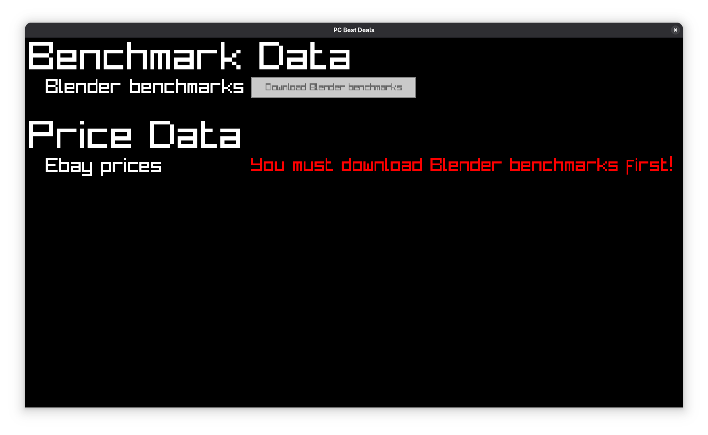
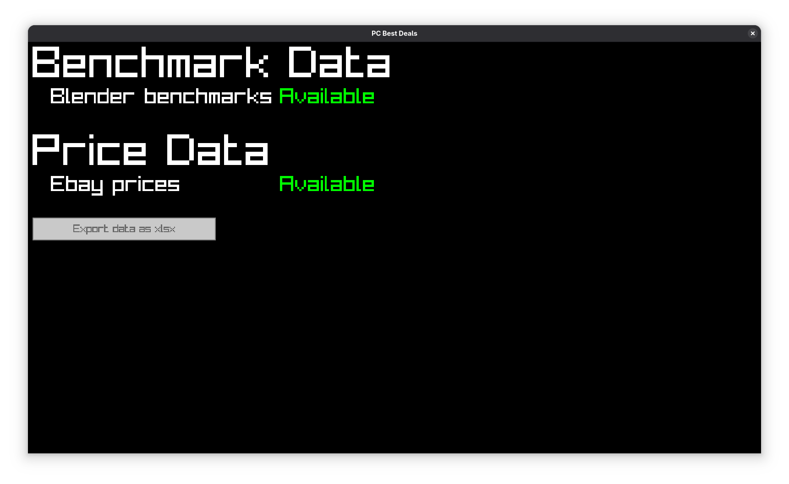
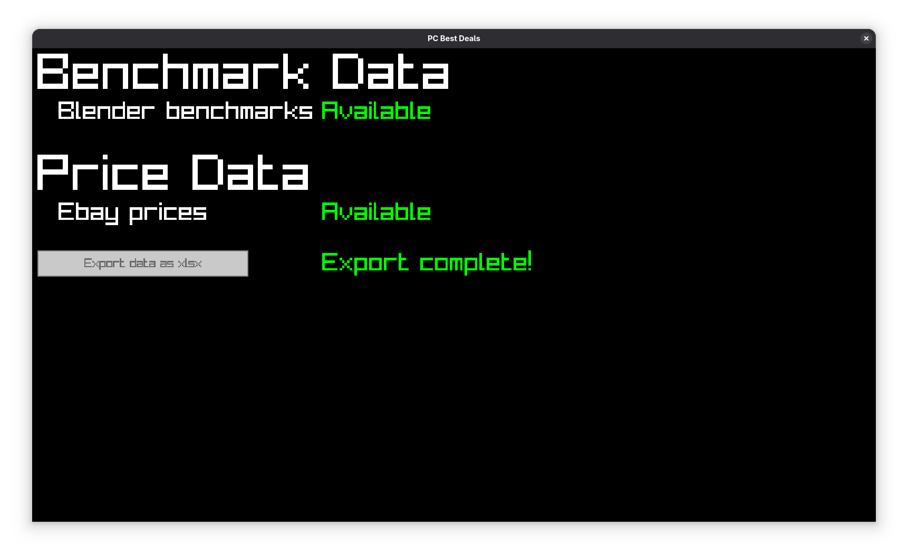

# PCBestDeals

<p float="left">
  
   
  
</p>

A program for finding the best PC part deals

## How to run

- Download the latest release
- Unzip it
- Register as a developer on [ebay](https://developer.ebay.com/)
- Create a file named credentials.txt
- Enter the client ID on the first line of the file and the client secret on the second line
- Run PCBestDeals or PCBestDeals.exe depending on your system

## How to build

- Register as a developer on [ebay](https://developer.ebay.com/)
- Create a file named credentials.txt
- Enter the client ID on the first line of the file and the client secret on the second line
```
chmod +x run.sh
./run.sh
```
